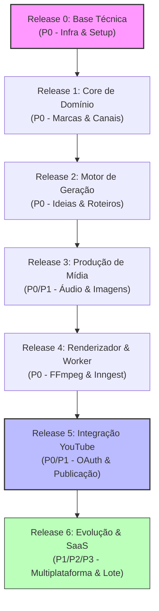

# Roteiro de Implementação — Creator Factory AI

Este documento apresenta o **Roadmap** oficial para o desenvolvimento da plataforma **Creator Factory AI**, consolidando as especificações do [PRD.md](file:///home/luis/Documentos/Git/DarkVideos/dark_factory/docs/PRD.md), os requisitos de [EPICS.md](file:///home/luis/Documentos/Git/DarkVideos/dark_factory/docs/EPICS.md) e as decisões de [ARQUITECTURE.md](file:///home/luis/Documentos/Git/DarkVideos/dark_factory/docs/ARQUITECTURE.md).

O objetivo é organizar o desenvolvimento de forma incremental, garantindo que cada release produza entregáveis funcionais e testáveis (abordagem de fatiamento vertical / _tracer bullet_).

---

## 1. Visão Geral do Roadmap

O desenvolvimento é estruturado em **7 fases (Releases 0 a 6)**, divididas por prioridades de entrega (P0, P1, P2 e P3). A arquitetura base do sistema é **YouTube-first, mas platform-agnostic**.



---

## 2. Detalhamento das Fases

### Fase 0 — Base Técnica (Release 0)

_Foco: Criação da infraestrutura essencial do projeto, garantindo conexões seguras com o banco e infraestrutura para tarefas de segundo plano._

- **Prioridade:** P0 (Bloqueante)
- **Épicos Relacionados:**
  - [EPIC 01 — Fundação técnica da aplicação](file:///home/luis/Documentos/Git/DarkVideos/dark_factory/docs/EPICS.md#L22)
  - [EPIC 22 — Storage de arquivos (Base local)](file:///home/luis/Documentos/Git/DarkVideos/dark_factory/docs/EPICS.md#L1156)
- **Checklist de Entregáveis:**
  - [x] Setup do framework principal com TanStack Start
  - [x] Modelagem de dados base configurada via Drizzle ORM + PostgreSQL (migrations iniciais)
  - [x] Endpoint do orquestrador de eventos Inngest `/api/inngest` ativo
  - [x] Setup de validações globais, linting, format e variáveis de ambiente (`.env.local`)
  - [x] Configuração do ambiente e infraestrutura básica de testes (Vitest)

---

### Fase 1 — Core do Domínio (Release 1)

_Foco: Implementar o modelo de dados de marcas, canais e o fluxo de projetos (vídeos em produção) sem integração externa._

- **Prioridade:** P0 (Essencial para o MVP)
- **Épicos Relacionados:**
  - [EPIC 02 — Autenticação e usuário](file:///home/luis/Documentos/Git/DarkVideos/dark_factory/docs/EPICS.md#L80)
  - [EPIC 03 — Gestão de marcas](file:///home/luis/Documentos/Git/DarkVideos/dark_factory/docs/EPICS.md#L127)
  - [EPIC 04 — Perfis de distribuição](file:///home/luis/Documentos/Git/DarkVideos/dark_factory/docs/EPICS.md#L188)
  - [EPIC 05 — Integração com contas de plataforma](file:///home/luis/Documentos/Git/DarkVideos/dark_factory/docs/EPICS.md#L249)
  - [EPIC 07 — Projetos de conteúdo](file:///home/luis/Documentos/Git/DarkVideos/dark_factory/docs/EPICS.md#L347)
- **Checklist de Entregáveis:**
  - [x] Login/Logout e proteção de rotas privadas (Auth base)
  - [ ] CRUD de Marcas (nicho, idioma, estilo padrão)
  - [ ] CRUD de Perfis de Distribuição (Shorts vs. Long Form)
  - [ ] Painel (Dashboard) principal de controle
  - [ ] Criação de Projetos de Conteúdo e gerenciamento de seus estados iniciais (`draft` a `ready_for_review`)

---

### Fase 2 — Motor de Geração Inteligente (Release 2)

_Foco: Criação de ideias e roteiros com IA, incluindo versionamento e histórico de roteiros._

- **Prioridade:** P0 & P1
- **Épicos Relacionados:**
  - [EPIC 08 — Geração de ideias com IA](file:///home/luis/Documentos/Git/DarkVideos/dark_factory/docs/EPICS.md#L403) (P0)
  - [EPIC 09 — Geração e versionamento de roteiros](file:///home/luis/Documentos/Git/DarkVideos/dark_factory/docs/EPICS.md#L451) (P0)
  - [EPIC 10 — Vídeos de referência e fórmulas criativas](file:///home/luis/Documentos/Git/DarkVideos/dark_factory/docs/EPICS.md#L510) (P1)
- **Checklist de Entregáveis:**
  - [ ] Integração com APIs de LLM (GPT/Gemini) para geração de ideias em lote baseado no nicho
  - [ ] Editor/Gerador de roteiros com versionamento de roteiro ativo no banco
  - [ ] Sistema de "fórmulas criativas" para analisar transcrições ou estruturas de vídeos de referência

---

### Fase 3 — Produção de Mídia (Release 3)

_Foco: Gerar a voz do vídeo (TTS), imagens para cobertura visual (Text-to-Image) e thumbnails._

- **Prioridade:** P0 & P1
- **Épicos Relacionados:**
  - [EPIC 11 — Geração de narração](file:///home/luis/Documentos/Git/DarkVideos/dark_factory/docs/EPICS.md#L564) (P0)
  - [EPIC 12 — Geração de assets visuais e thumbnail](file:///home/luis/Documentos/Git/DarkVideos/dark_factory/docs/EPICS.md#L619) (P0)
  - [EPIC 13 — Legendas e arquivos auxiliares](file:///home/luis/Documentos/Git/DarkVideos/dark_factory/docs/EPICS.md#L672) (P1)
  - [EPIC 23 — Configuração de providers de IA](file:///home/luis/Documentos/Git/DarkVideos/dark_factory/docs/EPICS.md#L1203) (P1)
- **Checklist de Entregáveis:**
  - [ ] Integração com Text-to-Speech (ElevenLabs ou OpenAI) para salvar narrações
  - [ ] Geração automática de planos de cenas/prompts para imagens
  - [ ] Integração com DALL-E/Midjourney/Stable Diffusion para gerar imagens de cena e Thumbnails
  - [ ] Transcrição de áudio e geração de arquivos `.srt`/`.vtt` de legendas

---

### Fase 4 — Renderização & Orquestração (Release 4)

_Foco: Orquestrar todas as etapas de geração de forma resiliente e rodar o worker FFmpeg para compilar o vídeo final._

- **Prioridade:** P0 (Essencial para o MVP)
- **Épicos Relacionados:**
  - [EPIC 14 — Renderização de vídeo](file:///home/luis/Documentos/Git/DarkVideos/dark_factory/docs/EPICS.md#L713)
  - [EPIC 15 — Orquestração da Content Factory com Inngest](file:///home/luis/Documentos/Git/DarkVideos/dark_factory/docs/EPICS.md#L773)
  - [EPIC 21 — Logs, auditoria e observabilidade](file:///home/luis/Documentos/Git/DarkVideos/dark_factory/docs/EPICS.md#L1107)
- **Checklist de Entregáveis:**
  - [ ] Setup do worker FFmpeg para combinar áudio (narração) e assets visuais (imagens/vídeos de cobertura)
  - [ ] Estilização/gravação de legendas (hardcode ou softcode) no vídeo final
  - [ ] Fluxo orquestrado no Inngest que une as etapas: Ideia -> Roteiro -> Narração -> Imagens -> Render
  - [ ] Logs de auditoria para cada passo da renderização (com suporte a reprocessamento)

---

### Fase 5 — Distribuição & Publicação (Release 5)

_Foco: Conectar canais via OAuth com o YouTube e realizar publicação de forma automatizada com aprovação prévia._

- **Prioridade:** P0 & P1
- **Épicos Relacionados:**
  - [EPIC 06 — OAuth e conexão com YouTube](file:///home/luis/Documentos/Git/DarkVideos/dark_factory/docs/EPICS.md#L297) (P0)
  - [EPIC 16 — Planos de publicação](file:///home/luis/Documentos/Git/DarkVideos/dark_factory/docs/EPICS.md#L838) (P0)
  - [EPIC 17 — YouTube Publisher Adapter](file:///home/luis/Documentos/Git/DarkVideos/dark_factory/docs/EPICS.md#L893) (P0)
  - [EPIC 18 — Revisão humana e checklist de publicação](file:///home/luis/Documentos/Git/DarkVideos/dark_factory/docs/EPICS.md#L947) (P0)
  - [EPIC 19 — Originalidade, qualidade e policy checks](file:///home/luis/Documentos/Git/DarkVideos/dark_factory/docs/EPICS.md#L1011) (P1)
  - [EPIC 20 — Agenda editorial](file:///home/luis/Documentos/Git/DarkVideos/dark_factory/docs/EPICS.md#L1059) (P1)
- **Checklist de Entregáveis:**
  - [ ] Fluxo OAuth com o YouTube para obtenção e renovação segura de tokens (refresh tokens)
  - [ ] Tela de aprovação humana com checklist de qualidade obrigatório antes da publicação
  - [ ] Adapter do YouTube funcional (Upload de arquivos, inserção de título/descrição/tags/thumbnail)
  - [ ] Agenda e calendário editorial de postagens (agendamentos e status)

---

### Fase 6 — Expansão & SaaS Readiness (Release 6)

_Foco: Preparar a plataforma para suportar novas redes (TikTok, Reels), geração em lote e métricas pós-publicação._

- **Prioridade:** P1, P2 & P3
- **Épicos Relacionados:**
  - [EPIC 24 — Content Factory em lote](file:///home/luis/Documentos/Git/DarkVideos/dark_factory/docs/EPICS.md#L1250) (P2)
  - [EPIC 25 — Preparação para múltiplas plataformas](file:///home/luis/Documentos/Git/DarkVideos/dark_factory/docs/EPICS.md#L1298) (P1)
  - [EPIC 26 — Analytics básico pós-publicação](file:///home/luis/Documentos/Git/DarkVideos/dark_factory/docs/EPICS.md#L1342) (P2)
  - [EPIC 27 — SaaS readiness](file:///home/luis/Documentos/Git/DarkVideos/dark_factory/docs/EPICS.md#L1390) (P3)
- **Checklist de Entregáveis:**
  - [ ] Estrutura de adapter multiplataforma homologada (TikTok e Instagram adapters no core)
  - [ ] Execução e fila em lote (gerar e programar 10+ vídeos de uma única vez)
  - [ ] Leitura periódica das métricas do YouTube API (visualizações, curtidas, inscritos)
  - [ ] Estrutura SaaS (assinaturas, isolamento fino de tenants e controle de uso)

---

## 3. Matriz de Priorização (Épicos vs. Releases)

| Épico       | Título                                    | Prioridade | Fase Alvo  | Status           |
| ----------- | ----------------------------------------- | ---------- | ---------- | ---------------- |
| **EPIC 01** | Fundação técnica da aplicação             | P0         | **Fase 0** | [ ] Não Iniciado |
| **EPIC 02** | Autenticação e usuário                    | P0         | **Fase 1** | [ ] Não Iniciado |
| **EPIC 03** | Gestão de marcas                          | P0         | **Fase 1** | [ ] Não Iniciado |
| **EPIC 04** | Perfis de distribuição                    | P0         | **Fase 1** | [ ] Não Iniciado |
| **EPIC 05** | Integração com contas de plataforma       | P0         | **Fase 1** | [ ] Não Iniciado |
| **EPIC 06** | OAuth e conexão com YouTube               | P0         | **Fase 5** | [ ] Não Iniciado |
| **EPIC 07** | Projetos de conteúdo                      | P0         | **Fase 1** | [ ] Não Iniciado |
| **EPIC 08** | Geração de ideias com IA                  | P0         | **Fase 2** | [ ] Não Iniciado |
| **EPIC 09** | Geração e versionamento de roteiros       | P0         | **Fase 2** | [ ] Não Iniciado |
| **EPIC 10** | Vídeos de referência e fórmulas criativas | P1         | **Fase 2** | [ ] Não Iniciado |
| **EPIC 11** | Geração de narração                       | P0         | **Fase 3** | [ ] Não Iniciado |
| **EPIC 12** | Geração de assets visuais e thumbnail     | P0         | **Fase 3** | [ ] Não Iniciado |
| **EPIC 13** | Legendas e arquivos auxiliares            | P1         | **Fase 3** | [ ] Não Iniciado |
| **EPIC 14** | Renderização de vídeo                     | P0         | **Fase 4** | [ ] Não Iniciado |
| **EPIC 15** | Orquestração com Inngest                  | P0         | **Fase 4** | [ ] Não Iniciado |
| **EPIC 16** | Planos de publicação                      | P0         | **Fase 5** | [ ] Não Iniciado |
| **EPIC 17** | YouTube Publisher Adapter                 | P0         | **Fase 5** | [ ] Não Iniciado |
| **EPIC 18** | Revisão humana e checklist                | P0         | **Fase 5** | [ ] Não Iniciado |
| **EPIC 19** | Originalidade e policy checks             | P1         | **Fase 5** | [ ] Não Iniciado |
| **EPIC 20** | Agenda editorial                          | P1         | **Fase 5** | [ ] Não Iniciado |
| **EPIC 21** | Logs e observabilidade                    | P0         | **Fase 4** | [ ] Não Iniciado |
| **EPIC 22** | Storage de arquivos                       | P0         | **Fase 0** | [ ] Não Iniciado |
| **EPIC 23** | Configuração de providers de IA           | P1         | **Fase 3** | [ ] Não Iniciado |
| **EPIC 24** | Content Factory em lote                   | P2         | **Fase 6** | [ ] Não Iniciado |
| **EPIC 25** | Preparação para múltiplas plataformas     | P1         | **Fase 6** | [ ] Não Iniciado |
| **EPIC 26** | Analytics básico pós-publicação           | P2         | **Fase 6** | [ ] Não Iniciado |
| **EPIC 27** | SaaS readiness                            | P3         | **Fase 6** | [ ] Não Iniciado |

---

## 4. Como Executar este Roteiro com o OpenSpec

Para iniciar qualquer um dos marcos propostos de forma consistente, a recomendação é usar o fluxo de **OpenSpec** local do projeto:

1. **Iniciar uma Proposta/Mudança:**
   Para propor um novo épico (por exemplo, a Fase 0 de fundação técnica), inicie uma mudança:
   ```bash
   # Utilizando a ferramenta de IA no chat ou CLI:
   /openspec-new
   ```
2. **Definir e Desenhar:**
   Construa os arquivos `proposal.md`, `design.md` e `tasks.md` correspondentes às metas específicas da fase atual.
3. **Aplicar a Mudança:**
   Após validar a proposta de mudança, utilize o fluxo de aplicação para gerar o código-fonte de maneira modular:
   ```bash
   /openspec-apply
   ```
4. **Verificar e Arquivar:**
   Uma vez concluída, verifique as alterações e arquive o progresso da fase:
   ```bash
   /openspec-verify
   /openspec-archive
   ```
